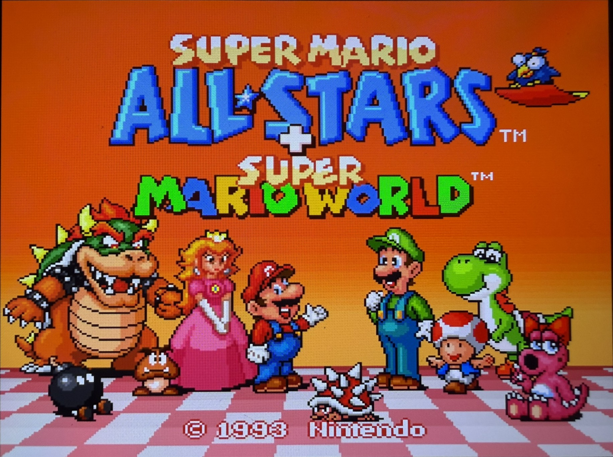
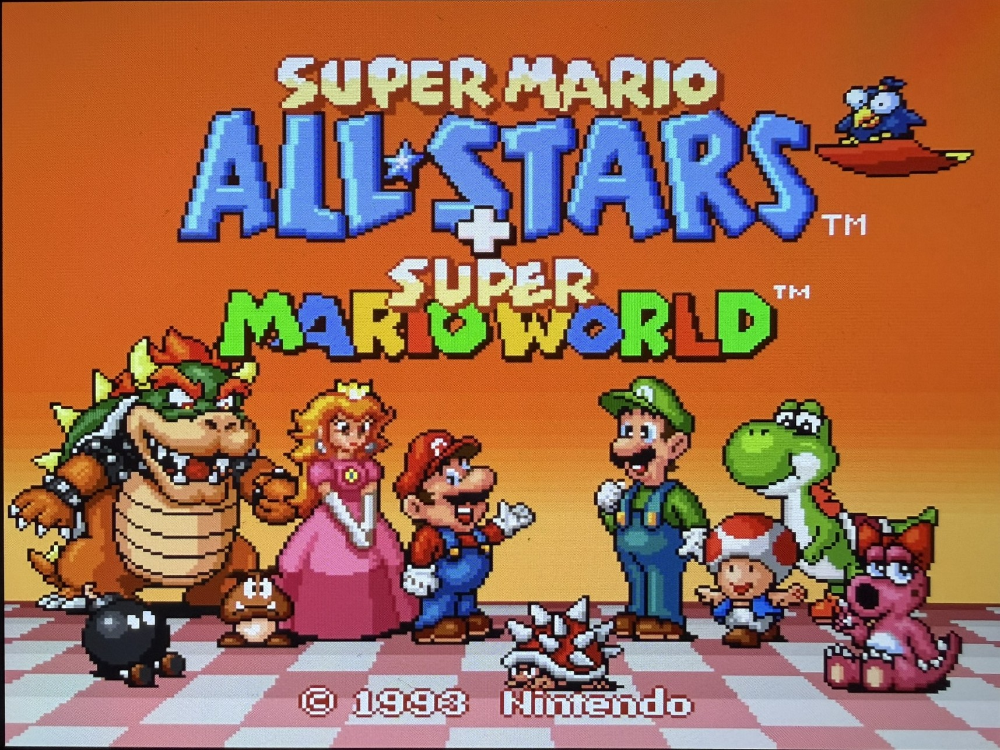
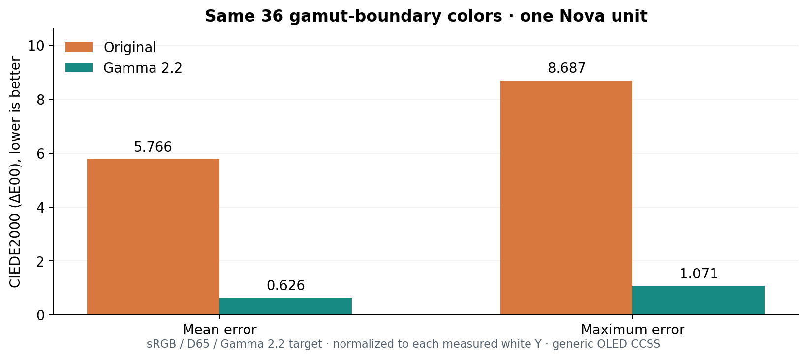
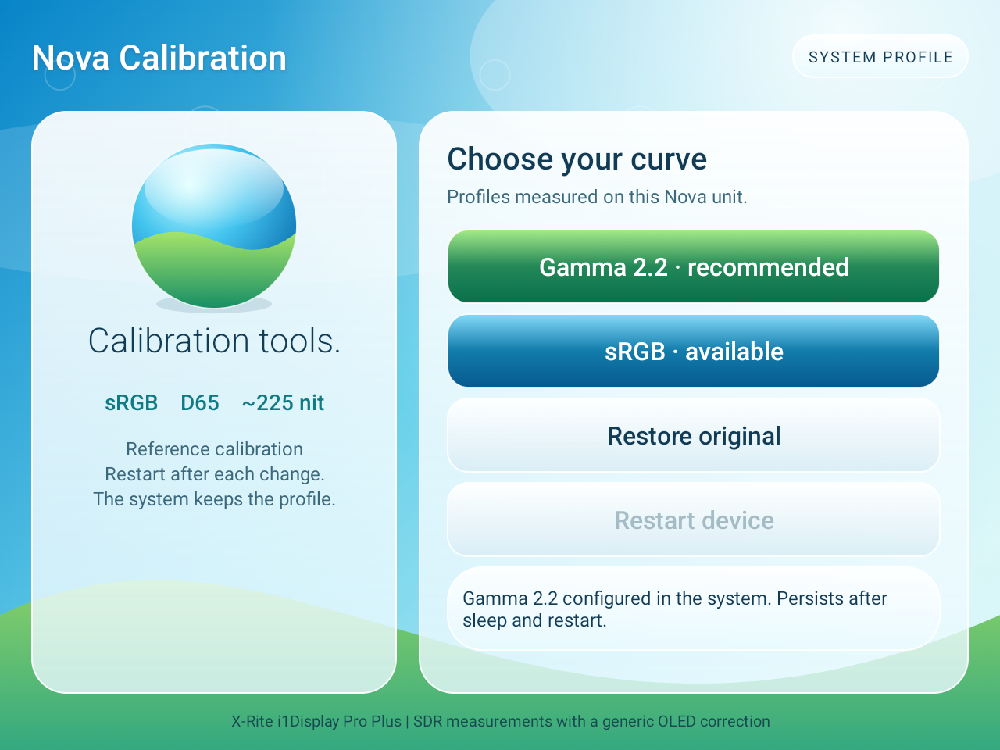

# Nova Display Calibration

**Measured SDR color profiles for the Retroid Pocket Nova. Applied once, loaded by the display system at boot.**

[**Download v1.0.0 APK**](https://github.com/pippopapera/nova-display-calibration/releases/download/v1.0.0/Nova-Display-Calibration-1.0.0.apk) · [Release notes and SHA-256](https://github.com/pippopapera/nova-display-calibration/releases/tag/v1.0.0)

A project by **pippopapera**, developed with substantial assistance from **OpenAI Codex**. [Contributors and the role of AI](CONTRIBUTORS.md).

The goal is a more accurate sRGB image, with a D65 white point and a measured tone response. This is a colorimeter-based alternative to adjusting saturation by eye. Choose **Gamma 2.2** or **sRGB**, restart, and use the console normally. The app does not run a background service to keep the calibration active.

**Compatibility:** validated on one Retroid Pocket Nova running `RPN_V1.0.0.436_20260722_083524_user`, with panel identifier `il97680a_amoled_panel_without_DSC`. The installer checks both the firmware build and the original panel configuration checksum. Other units may differ; other firmware and handheld models are unsupported.

## What it looks like

<table>
  <tr><th>Original</th><th>Gamma 2.2 calibrated</th></tr>
  <tr>
    <td width="50%"></td>
    <td width="50%"></td>
  </tr>
</table>

Owner-supplied iPhone photographs of the same game screen. The owner identified OFF as **Restore original** and ON as **Gamma 2.2**, with system saturation at 100%. OdinTools is no longer installed on the test device. Camera exposure, white balance, processing, framing, and your viewing display affect this comparison. These photographs illustrate the appearance; they do **not** measure color accuracy. Public copies have location/EXIF metadata removed, with identical decoded pixels and no recompression. [Photo integrity checks](docs/verification/photo-integrity.json).

## What was measured

An **X-Rite i1Display Pro Plus EODIS3PL** measured full-screen patches on the console. The final validation campaign contains **921 readings**, including Gamma 2.2 at every 10% brightness step from 0% to 100%.

| Same 36 colors near the gamut boundary | Original | Gamma 2.2 |
|---|---:|---:|
| Mean ΔE00 — lower is better | 5.766 | 0.626 |
| Maximum ΔE00 | 8.687 | 1.071 |

Both are compared with the same sRGB/D65/Gamma 2.2 target, normalized to each profile's measured white luminance. The original white tint is not adapted away. This sample demonstrates improved color accuracy; it does not establish that every RGB value or game is corrected perfectly.

**Measurement limitation:** the sensor used a generic **OLED Family 2018 CCSS**, not a spectroradiometer correction matched to this exact panel. Absolute XYZ/ΔE results are provisional. One measured unit is not a guarantee for every Nova.

[Full measurements and methodology](docs/MEASUREMENTS.md) · [All 921 RGB/XYZ readings](docs/data/readings.csv) · [Brightness results](docs/data/brightness-analysis.json)

## Daily use

1. Download the signed APK from [Releases](https://github.com/pippopapera/nova-display-calibration/releases/tag/v1.0.0). Allow installation from your browser or file manager if Android asks, install it, then open **Nova Calibration**.
2. Choose **Gamma 2.2 · recommended** or **sRGB**.
3. Press **Restart device** when requested. A full restart is needed after an actual profile change.
4. Use your console normally. You can close the app and change the brightness.

The reference is **about 225 cd/m² at Android brightness 173/255**, approximately 68% on the tested slider. Applying a different profile sets this reference brightness; selecting the current profile again preserves your brightness. The brightness sweep retained the correction, with estimated gamma around **2.18–2.22**. Accuracy varies somewhat with brightness, especially close to black at the lowest setting.

Keep **system saturation at 100%**. OdinTools does not need to stay installed. If it was used to change saturation, restore 100% before applying a profile; uninstalling a settings app should not be treated as confirmation that its settings were reset. Avoid stacking night-light, color filters, emulator color corrections, or shaders unless you intentionally want a different result.

**Before uninstalling this app or updating the firmware:** choose **Restore original**, then restart. Uninstalling the APK alone does not remove the system profile. Restoring also restores the brightness settings saved before the first profile installation.

## Small app, system-managed calibration

- **No background service, boot receiver, permanent notification, polling loop, or calibration overlay.** The display system keeps the hardware correction after boot and sleep. Android may cache the app process after closing it; no recurring calibration work is scheduled.
- **No Android permissions declared:** no camera, microphone, location, Internet, shared storage, or notification access.
- **Six languages:** English, Italian, German, Spanish, French, and Portuguese, following Android's language preferences. The default resources are English.
- **Measured profiles, not automatic measurement:** the APK applies this project's existing calibration. The colorimeter and acquisition software were used on a PC; this is not a universal Android version of DisplayCAL.

The implementation avoids ongoing application work. A controlled FPS or battery-life A/B benchmark has **not** been performed, so no numerical performance or battery claim is made.

## How the correction works

The display pipeline provides tone tables (**IGC/GC**) and a color/white-point matrix (**PCC**). The measured correction is stored as a QDCM override under `/data/vendor/display/`. The Qualcomm display compositor loads it at boot and manages it when the screen wakes. SurfaceFlinger's color matrix remains the identity.

The APK contains **only our calibration deltas**. It reads the original configuration already installed on the console, checks its SHA-256, reconstructs the measured profile, and verifies the result before installation. It does not distribute the manufacturer's configuration. Only the NATIVE/sRGB fields are changed; HDR and Display P3 retain their factory data and have not been calibrated by this project.

Writing the override uses **PServerBinder, a privileged service already supplied by this firmware**. Zero manifest permissions does not mean the app operates without privilege. The project does not install a root manager, patch the firmware/kernel, or change SELinux policy. The test unit's bootloader was already unlocked; operation on a locked unit has not been independently verified.

[Implementation and safeguards](docs/ARCHITECTURE.md) · [Security and recovery](docs/SECURITY.md) · [Build and validation](docs/BUILDING.md)

## Why Gamma 2.2?

Gamma 2.2 and sRGB both measured well against their respective tone targets. At the reference brightness, their differences were too small, with too little repeated sampling, to establish a general winner. Gamma 2.2 is recommended because it also completed the full brightness sweep. **sRGB remains a valid option.** OLED subpixel layout alone does not decide between them.

This project does not claim to have proven or universally fixed “color crush,” achieved certified 100% sRGB accuracy, or beaten OdinTools at 70% saturation in a measured comparison. The evidence supports the specific results in the measurement report.

## Development and credits

Source, profile deltas, measurement exports, and checks are provided for inspection. **OpenAI Codex** contributed to implementation, measurement analysis, device verification, and documentation. The hardware measurements and recorded validation results are the basis for the claims. [Contributors](CONTRIBUTORS.md) explains those roles; corrections and independent measurements are welcome. [Contributing](CONTRIBUTING.md).

Thanks to the handheld community for documenting the color issue, to the OdinTools project for documenting the OEM service interface, and to ArgyllCMS for the measurement tools. [Third-party notes](THIRD_PARTY.md).

Project code and original calibration data use the [MIT license](LICENSE). Game artwork visible in the comparison photographs belongs to its respective rights holders and is not covered by that license. This project is not affiliated with Retroid, Qualcomm, X-Rite, or Nintendo.

*Quack. This time, the duck brought a colorimeter.*
