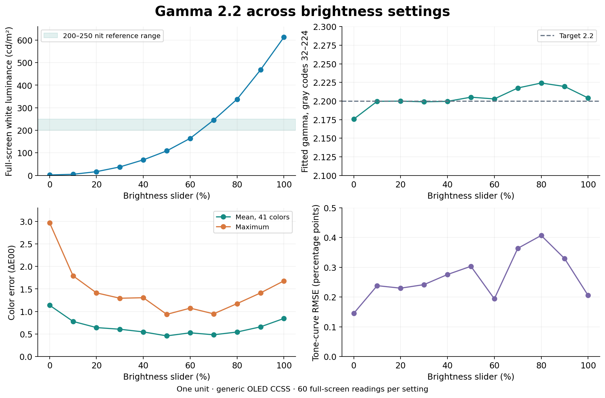

# Measurement results and limitations

## Target and setup

| Item | Setting |
|---|---|
| Device | One Retroid Pocket Nova |
| Firmware | `RPN_V1.0.0.436_20260722_083524_user` |
| Firmware panel identifier | `il97680a_amoled_panel_without_DSC` |
| Instrument | X-Rite i1Display Pro Plus EODIS3PL |
| Spectral correction | Generic OLED Family 2018 CCSS; provisional |
| Color target | SDR, sRGB primaries, D65 |
| Tone targets | Gamma 2.2 and sRGB, each assessed against its own response |
| Reference brightness | Android 173/255, approximately 68% of the tested slider |
| Reference white | Approximately 225 cd/m² |
| Patches | Full-screen, 1280 × 960; one-second settling interval |
| System saturation | 100% in the original and calibrated comparisons |

ArgyllCMS `spotread` ran on the PC. Android showed the patches on the handheld; the PC monitor's ICC profile was not part of that path. Patch ID, RGB code, full-screen geometry, and ready state were checked during acquisition. Native IGC/GC/PCC state was checked before and after the relevant measurement runs.

Full-screen patches were selected to avoid sensor-position ambiguity on a small screen. Full-screen OLED luminance may differ from small highlight-window measurements. These results are SDR measurements, not peak HDR specifications.

## Final campaign: 921 readings

| Series | Readings |
|---|---:|
| Gamma 2.2: reference plus 0–100% brightness in 10% steps, 60 patches each | 720 |
| Separate final Gamma 2.2 and sRGB reference runs, 60 patches each | 120 |
| Original and Gamma 2.2 gamut-boundary runs, 39 patches each | 78 |
| Final white confirmation | 3 |
| **Total** | **921** |

Earlier pilot measurements, failed attempts, and covered-screen samples are excluded. The CSV exports the original recorded RGB/XYZ numbers, removing computer paths and device identifiers. Version 0.4 changes packaging and reconstructs the same calibrated payloads; it does not add new optical readings to this count.

## Original versus calibrated saturated colors

The 36 color patches cover six ramps starting at full red, green, blue, cyan, magenta, and yellow. Initially zero channels are increased through codes 0, 16, 32, 48, 64, and 96 while the other channels stay at 255. Each run also includes start/end white and black.

| Measurement | Original | Gamma 2.2 |
|---|---:|---:|
| Mean ΔE00, 36 colors | 5.766 | 0.626 |
| Maximum ΔE00 | 8.687 | 1.071 |
| Mean white luminance, cd/m² | 250.681 | 224.969 |
| Nearly identical adjacent pairs under the stated criterion | 0/30 | 0/30 |

Both profiles use the same sRGB/D65/Gamma 2.2 target. Targets are scaled to the mean measured white luminance of each run, without adapting away white chromaticity error or subtracting black. A near-identical pair was defined descriptively as measured adjacent ΔE00 below 0.1 while the target difference is at least 0.5. This is not a statistically established clipping threshold.

The tested original profile did not produce a clearly flattened pair by that criterion. Therefore this project claims **improved measured color accuracy**, not proof that an established clipping fault was eliminated. It did not measure OdinTools at 70%, and these samples do not cover the entire RGB cube.

[Detailed boundary results, including every sampled pair](data/boundary-comparison.json)

## Gamma 2.2 versus sRGB

Two separate reference runs used the same PCC matrix and GC table; IGC changed with the requested tone curve. Each profile is evaluated against its own EOTF, with the same sRGB primaries and D65 target.

| Measurement | Gamma 2.2 | sRGB |
|---|---:|---:|
| Mean white luminance, cd/m² | 225.204 | 225.150 |
| Mean ΔE00, 41 colors | 0.485 | 0.459 |
| Maximum ΔE00, 41 colors | 0.927 | 0.898 |
| Mean ΔE00, 16 grays | 0.833 | 0.839 |
| Maximum ΔE00, 16 grays | 1.503 | 1.461 |
| Tone-curve RMSE, percentage points | 0.306 | 0.326 |

The small differences do not establish a statistically significant winner: there was one final run per profile, taken at different times. Gamma 2.2 is the recommendation because it also completed the full brightness sweep. The choice is evidence-based; OLED subpixel arrangement alone does not require one of these tone functions.

Near-black codes represent different physical luminances under the two curves. A lower absolute near-black RMSE alone does not prove better resolution of a panel defect. These 41-color means must not be compared directly with averages over a different patch grid.

[Per-patch reference data](data/transfer-comparison.json)

## Brightness sweep

Each setting used 60 full-screen patches: 41 colors, 16 grays, start/end white, and black. Gamma was fitted through normalized white using gray codes 32–224. Targets were scaled to each setting's measured white luminance; chromaticity remained D65.

| Slider | Android | White cd/m² | Fitted gamma | Mean / maximum color ΔE00 |
|---|---:|---:|---:|---:|
| Reference, approximately 68% | 173 | 224.914 | 2.213 | 0.482 / 0.943 |
| 0% | 1 | 1.782 | 2.176 | 1.139 / 2.968 |
| 10% | 26 | 4.778 | 2.200 | 0.780 / 1.791 |
| 20% | 52 | 16.509 | 2.200 | 0.643 / 1.413 |
| 30% | 77 | 37.551 | 2.199 | 0.606 / 1.294 |
| 40% | 103 | 68.819 | 2.199 | 0.547 / 1.305 |
| 50% | 128 | 108.736 | 2.205 | 0.459 / 0.936 |
| 60% | 153 | 164.345 | 2.203 | 0.527 / 1.074 |
| 70% | 179 | 245.203 | 2.217 | 0.483 / 0.948 |
| 80% | 204 | 337.889 | 2.224 | 0.545 / 1.175 |
| 90% | 230 | 467.945 | 2.219 | 0.659 / 1.411 |
| 100% | 255 | 612.975 | 2.204 | 0.846 / 1.680 |



All 30 sampled intensity-ramp transitions at every setting increased. That demonstrates separation for those sampled levels; it does not certify every adjacent code, every pixel, or every content path. Near-black readings at minimum brightness are particularly limited by the instrument. The report flags readings below 0.05 nit and increments below 0.02 nit for caution; those are reporting thresholds, not newly measured instrument specifications.

The final three white checks averaged **225.0265 cd/m²**, xy **0.313018 / 0.329856**. The calibration remains optimized around its 225-nit reference, although brightness can be changed without losing the profile.

## Reproducing the numbers

The repository includes [all 921 readings](data/readings.csv), [dataset provenance](data/provenance.json), [full brightness analysis](data/brightness-analysis.json), and [final white values](data/final-white.json).

With Python and NumPy installed:

```text
python tools/verify-measurements.py
```

This recalculates color errors from the CSV using the published CIEDE2000 and target equations, then checks all reported color-error means/maxima and the final white. It uses the original campaign's method; it is not an independent measurement. [Reproduction result](verification/measurement-reproduction.json).

`tools/render-charts.py` regenerates the English charts with Matplotlib. Neither tool changes the camera photographs.

## What remains unproven

- Spectroradiometer-referenced absolute accuracy for this exact panel.
- Transferability of this unit's calibration to every Nova.
- Uniformity across the entire panel, every RGB code, or every emulator/game rendering path.
- Calibration of HDR or Display P3.
- Statistically significant superiority of Gamma 2.2 over sRGB.
- A direct measured comparison with OdinTools at 70% saturation.
- Numerical FPS or battery-life impact.

Camera photographs cannot resolve these limits. They are a visual example, with metadata removed but image pixels left unchanged.
